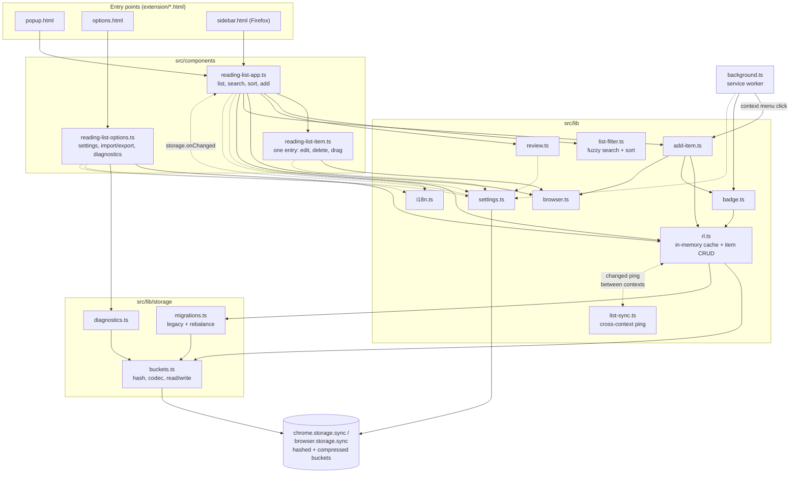
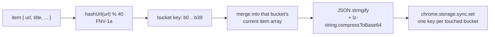

# AGENTS.md

Guidance for AI coding agents (Claude Code, or any other agent) working in this repository.

## Overview

This is a Chrome and Firefox browser extension for saving pages to read later. It uses Manifest V3, TypeScript, and Lit for web components. The extension is published on the Chrome Web Store and Firefox Add-ons.

## Architecture



Three HTML entry points, each mounting Lit components:

- **`extension/popup.html`** — the popup shown when clicking the extension icon, mounts `<reading-list-app>`
- **`extension/options.html`** — settings page, mounts `<reading-list-options>`
- **`extension/sidebar.html`** — Firefox sidebar panel, mounts the same `<reading-list-app>` bundle as the popup

Source (`src/`):

- **`src/background.ts`** — Manifest V3 service worker: context menu ("Add page to Reading List"), badge sync on tab activate/update, no persistent background context
- **`src/components/reading-list-app.ts`** — main list UI: search/filter/sort, add-current-page button, drag-and-drop reordering, staggered reveal animation, the edit-mode dimming overlay. `render()` is split into `_renderHeader()`/`_renderSearch()`/`_renderControls()`/`_renderList()`, one private method per seam — keep new UI regions in their own method rather than growing one of these or reinflating a single monolithic `render()`.
- **`src/components/reading-list-options.ts`** — settings page: default-behavior checkboxes, export/import, Storage Diagnostics, Clear Reading List
- **`src/components/reading-list-item.ts`** — a single list entry: inline title editing, slidein/slideout animations, delete/edit buttons
- **`src/components/theme.styles.ts`** — **the single source of every color, shadow and shared typography value in the app** (`--rl-bg-color`, `--rl-page-bg-color`, `--rl-text-color`, `--primary-color`, `--rl-shadow`, `--rl-focus-color`, etc.), light and dark. Composed into every Shadow-DOM component as `static override styles = [theme, styles]`. **No component's own `*.styles.ts` may define a CSS custom property or a hardcoded color/hex/rgba literal** (`currentColor` and `transparent` are fine, they aren't colors to theme) — add a new token to `theme.styles.ts` and reference it with `var(...)` instead, even for a one-off/decorative color. This used to not be true — components each carried their own local, independently-drifting color variables (the options page alone had a low-contrast dark-mode bug from this) — the whole point of consolidating was a single place to fix a color and a single place to look for its value.
- Two files sit **outside every shadow root** and so can't `import` `theme.styles.ts` at all: `extension/shell.css` (the `popup.html`/`sidebar.html` page-shell CSS) and `extension/options.html`'s inline `<style>`. Both carry a literal, hand-duplicated copy of the relevant `theme.styles.ts` values with a comment pointing back to it — if you change a token in `theme.styles.ts` that's also used there (currently just the page background / text color), update both by hand. There's no build step tying them together.
- **`src/lib/rl.ts`** — the `RL` in-memory cache and item CRUD (see Storage architecture below)
- **`src/lib/storage/buckets.ts`** — bucket codec: hashing, keys, compress/decompress, read/write, and `ListItemData`
- **`src/lib/storage/migrations.ts`** — legacy one-key-per-item migration and the bucket-count rebalance
- **`src/lib/storage/diagnostics.ts`** — `getStorageDiagnostics()`, behind the Options → Advanced button
- **`src/lib/settings.ts`** — `Settings`, `DEFAULT_SETTINGS`, `getSettings()`, `updateSettings()`, and `onSettingsChanged()` (see Cross-context sync)
- **`src/lib/list-sync.ts`** — the "list changed" ping that keeps contexts in step (see Cross-context sync)
- **`src/lib/add-item.ts`** — build an item, add it, log failure, sync the badge; shared by the popup and the context menu
- **`src/lib/list-filter.ts`** — fuzzy search (Fuse.js) + sort/filter logic
- **`src/lib/badge.ts`** — sets the toolbar badge (✔) when the active tab's URL is already on the list
- **`src/lib/browser.ts`** — Firefox/Chrome detection, `getActiveTab()`, tab-opening helper
- **`src/lib/review.ts`** — synthetic "leave a review" nag list item (shown once, after 6+ saved items)
- **`src/lib/i18n.ts`** — thin wrapper over `chrome.i18n.getMessage`, backed by `_locales/`
- **`src/lib/build-info.ts`** — `BUILD_TAG`, a one-line marker surfaced as `Build: ...` in Storage Diagnostics, purely so a stale/un-reloaded extension instance can be told apart from a real bug while debugging (this cost real time once — a popup instance kept open across an extension reload kept silently running old code). Bump it by hand on any build you want to visibly confirm was actually loaded; switch it to the manifest version at release time.

`extension/shell.css` holds the page-shell CSS (`:root` tokens, reset, `body` typography, dark mode) shared by `popup.html` and `sidebar.html`, which are otherwise identical apart from the popup's fixed width and the `body` class.

**Relative imports carry `.js` extensions** (`import { x } from './storage/buckets.js'`), with `moduleResolution: "bundler"` in `tsconfig.json`. This is required once these modules import each other and are loaded as native ESM — dropping the extension breaks resolution outside the bundler (e.g. the Node test harness below). Keep it consistent; a single extensionless import is enough to break things in a confusing way.

## Storage architecture (`src/lib/rl.ts`, `src/lib/storage/`)

Items are **not** stored one key per bookmark. `chrome.storage.sync`/`browser.storage.sync` cap the item count at `MAX_ITEMS = 512` **keys**, regardless of value size — storing `{ [item.url]: item }` per bookmark (the original design) hard-caps the list at ~511 items even when the ~100KB byte quota has headroom left.

Instead, items are grouped into a fixed number of **hashed buckets** (`BUCKET_COUNT = 40`, key format `b${hash(url) % 40}`), each holding a compressed array of items. This removes the per-item key cap; the real ceiling becomes the ~100KB total byte quota. Verified capacity: **~1,200 items** (vs. ~511 with the old per-item-key scheme).



Two non-obvious things to know before touching this code:

1. **Compression must be `compressToBase64`, not `compressToUTF16`.** `lz-string`'s `compressToUTF16` packs data into high-value UTF-16 code points to maximize density *per code unit* — but `chrome.storage.sync`/`browser.storage.sync` measure quota usage in real **UTF-8 bytes** (however they serialize for sync/persistence), and those code points mostly cost 3 bytes each in UTF-8. In practice this made `compressToUTF16` output use **~2.8x more real storage** than its JS string `.length` suggested — bad enough that it was no better than storing uncompressed JSON. `compressToBase64` is ASCII-only (1 byte per character), so it doesn't have this blowup, and nets a genuine ~35-40% size reduction. `decodeBucket()` tries base64 first and falls back to the UTF16 decoder, so buckets written before this fix still read correctly.
2. **`BUCKET_COUNT` must stay small enough that each bucket holds many items.** LZ-style compression only pays off when there's redundant text within one blob (repeated property names, similar URLs). At 512 buckets, most buckets held only 1-4 items each — too little redundancy to compress well, plus fixed per-blob format overhead on every bucket. 40 buckets was chosen empirically as the point where each bucket's blob is big enough for compression to help while staying safely under the 8KB-per-bucket quota (see the byte-math comment above `BUCKET_COUNT` in `rl.ts` for the numbers). If `BUCKET_COUNT` needs to change again, bump the version and rely on the rebalance migration below — don't just edit the constant.

**Migrations run automatically inside `getListItems()`** (via `loadAllBucketStorage()`), in order:
1. `migrateLegacyItems()` — one-time move from the original one-key-per-URL layout into buckets, for anyone updating from before bucketing existed. Verifies the new bucket keys were written correctly before removing the old ones.
2. `rebalanceBucketsIfNeeded()` — versioned via a `__bv` storage key holding the `BUCKET_COUNT` last used. If it doesn't match the current `BUCKET_COUNT`, all existing items are re-read (works regardless of the old scheme, since it just scans any `b\d+` key), re-grouped under the current scheme, and old bucket keys no longer used by the new scheme are deleted. This is what makes changing `BUCKET_COUNT` safe.

**Never loop a per-item write.** Each `addReadingItem`/`updateReadingItem` is its own `chrome.storage.sync.set()` call, and `storage.sync` rate-limits writes. At the ~1,200-item capacity this design allows, `for (item of items) await rl.updateReadingItem(...)` means over a thousand sequential writes. This shape has appeared twice: in `importList()` and in drag-reorder. Both now group items by bucket and write each bucket once — `rl.bulkAddReadingItems(items)` (chunked) and `rl.reorderItems(urls)` (a single `set()`). Reuse `groupItemsByBucket()` rather than adding a third copy of that logic.

A caution from getting this wrong once: an import failing partway through with `QuotaExceededError: storage.sync API call exceeded its quota limitations` was diagnosed as a write-rate throttle and "fixed" with retry/backoff. The real cause was the `compressToUTF16` byte accounting above — it was the `QUOTA_BYTES` ceiling, hit early because every item cost ~2.8x what it appeared to. Retrying a full quota can never succeed, so the retries only delayed the failure report; they've since been removed. That error message does not distinguish which quota was hit, so **use the Storage Diagnostics button to find out which limit you're actually against before theorising.**

**`updateReadingItem` skips no-op writes.** It returns early when every key in `updates` already equals the current value, because `background.ts` calls it with `{viewed: true}` on every tab activation and would otherwise re-write the bucket on every switch to an already-viewed saved page.

**The mutators lazily initialize.** `addReadingItem`/`removeReadingItem`/`updateReadingItem` call `getListItems()` themselves if needed. They used to silently `return` when uninitialized, which made `viewed` tracking depend on `handleTabUrl` happening to call `syncBadgeForTab()` (and thus `getListItems()`) first — reordering two lines would have broken it with no error.

**Any code path that writes to storage outside `rl`'s own methods must also update `rl`'s in-memory cache**, or go through `rl`. `rl` is a per-page singleton (`export const rl = new RL()`) holding `this.list` + `this.initialized`; `getListItems()` only re-fetches from storage when `!this.initialized`. `_onResetClick()` used to call `chrome.storage.sync.clear()` directly, which left the in-memory cache stale — Export right after Clear would return the old cached list even though storage was actually empty. Use `rl.clearAll()` instead, which clears storage and resets the cache together.

**`getStorageDiagnostics()`** (wired to the "Storage Diagnostics" button in Options → Advanced) reports item/bucket counts and both `chrome.storage.sync.getBytesInUse()` (the browser's real number) and a manual UTF-8-byte estimate side by side. If those two numbers ever diverge significantly again, that's the fastest way to catch another byte-accounting bug like the one above — trust `getBytesInUse()` over any hand-rolled estimate.

## Cross-context sync

The popup, sidebar, options page and service worker are separate page contexts. Each loads its own copy of the modules, so each has its own `RL` singleton with its own `this.list`. Nothing about `chrome.storage.sync` notifies one context that another wrote, so without explicit syncing a write in one leaves every other stale — most visibly in Firefox, where the sidebar stays open while you browse.

Two mechanisms, deliberately different:

**Item changes use one payload-free ping** (`src/lib/list-sync.ts`). Every `RL` mutator calls `broadcastListChange()` after it writes. A receiving context sets `initialized = false`, re-reads from storage, and notifies subscribers — that is the entire handler, with no per-change-type logic. `chrome.runtime.sendMessage` does not deliver back to the sending context, so a context never reacts to its own writes.

**Settings use `chrome.storage.onChanged`** (`onSettingsChanged()` in `src/lib/settings.ts`). They live under one small `settings` key whose change event already carries `newValue`, so there's nothing to re-read, and `onChanged` picks up every writer automatically — including the options page — so nobody has to remember to broadcast. This is what keeps sort and all/unread in step between views.

### Why a ping rather than typed deltas

A delta version was built and measured (broadcasting `add`/`remove`/`update`/`reload` and applying each to the cache). It avoided the re-read, but it was ~50% more code and, more importantly, a mutator that forgot to broadcast would drift silently and permanently. With the ping there is one message shape and one code path, and a missed broadcast self-heals the next time anything else changes. That robustness is the reason for the choice, not the line count.

The cost is real but small: a full `get(null)` plus decompressing all 40 buckets per change, in non-originating contexts only — measured at ~10ms median (23ms worst case) for 1,000 items. Don't "optimize" this back into deltas without a measured reason.

### Traps in this area

- **A removal arriving from another context must never reach `delete-item` / `rl.removeReadingItem()`.** That's the *local* delete path; routing a synced removal through it writes the deletion to storage a second time and re-broadcasts it. `reading-list-item.ts` keeps a `_localDelete` flag so the shared `slideout` animation can end in one of two events: `delete-item` for a real click, `remove-animation-end` for a remote removal, which only drops it from local state.
- **The component detects removals by diffing**, since the ping carries no payload: it compares its previous `_listItems` against the freshly re-read list. Urls that disappeared animate out, urls that appeared slide in. A side benefit is that this catches changes from any source, not only ones that remembered to broadcast.
- **Animating a synced removal means rendering an item that no longer exists in `rl.list`** — the component holds it as a ghost in `_listItems` until the animation finishes. Two ways that got stuck, both now guarded, and both produced the same symptom, *a deleted item reappearing when the search was cleared*:
  - the item was filtered out of view, so no element existed to animate and `animationend` never fired. The decision to animate therefore tests the **visible** set (`_visibleItems`), not the full list.
  - the item was hidden by a search/filter change *mid*-animation, cancelling it with no event. A timeout finalizes the removal as a fallback.
- **Node tests don't cover any of this.** The mocks define `chrome.storage.sync` but not `chrome.runtime` or `chrome.storage.onChanged`, so registration must be guarded (it is, via optional chaining) or every test fails at import — `RL`'s constructor registers at module load. Animations and DOM lifecycle can only be checked in a browser.
- **Every component showing settings must subscribe to `onSettingsChanged`**, not just read them once on connect. Both `reading-list-app.ts` and `reading-list-options.ts` do. The options page originally didn't, so its checkboxes went stale whenever a setting changed in another context. Subscribe in `connectedCallback` (releasing any previous subscription first — it can fire more than once) and unsubscribe in `disconnectedCallback`.
- **`.reading-list-item.slideout` needs `animation-fill-mode: forwards`.** Without it, the instant the animation ends the browser discards its final keyframe and the element snaps back to fully visible until something else changes the DOM. That's harmless for a *remote* ghost removal (`_onRemoteRemoveAnimationEnd` → `_finishRemoval` is synchronous, no gap for a reverted frame to paint), but a *local* delete has a real async gap there (`_onDeleteItemClicked` awaits `rl.removeReadingItem()` before updating `_listItems`), long enough for the browser to paint the reverted frame — the just-deleted item flashing back for a frame or two before actually disappearing. Confirmed by page-tagged console logging across both windows simultaneously: two earlier theories (a cross-context storage race, then `chrome.runtime.sendMessage` self-delivering to its own sender) were each investigated, built fixes for, and directly disproven this way before finding the real cause — see `architecture-audit_v3.md` if it still exists locally for that history.

## Build and Development

### Commands

```bash
npm install           # Install dependencies
npm run build          # tsc && rollup -c — compiles TS to extension/scripts/, bundles to build/
npm run format          # Format code with Prettier
npx tsc --noEmit         # Fast typecheck only, skips the Rollup bundle step — use this while iterating
```

There is no automated test suite (`npm test` is a stub). For logic that touches `chrome.storage.sync` (`rl.ts` and `lib/storage/`), the established pattern is: compile with `npm run build`, then run a small Node script that sets `globalThis.chrome.storage.sync` to an in-memory mock (get/set/remove/clear/getBytesInUse) and dynamically `import()`s the compiled output under `extension/scripts/lib/` directly — no browser needed.

Two things make these mocks worth writing carefully:
- **Enforce the real quotas.** A mock that also enforces `QUOTA_BYTES`, `QUOTA_BYTES_PER_ITEM` and the write-rate limit (throwing the same `QuotaExceededError` shape) is what caught both the bucket-count and compression-encoding bugs. A permissive mock passes and hides real quota problems.
- **Count `set()` calls.** Asserting on the number of write operations is how the per-item-write bugs above get caught before they ship.

### Full package + verify workflow

After a change to anything under `src/` or `extension/`, this is the loop used throughout this project:

```bash
npm run build
rm -f dist/reading-list-chrome.zip
(cd build && zip -r -q -X ../dist/reading-list-chrome.zip . -x '*.DS_Store')
npx web-ext build --source-dir=build --artifacts-dir=dist --overwrite-dest --filename=reading-list-firefox.zip
npx web-ext lint --source-dir=build
```

### Loading into Browser

**Chrome:**
1. Go to `chrome://extensions/`
2. Enable "Developer Mode"
3. Click "Load unpacked" (first time) → select the `build` folder, or click the reload icon (↻) on the extension's card thereafter
4. Chrome does **not** auto-reload an unpacked extension when files on disk change — always click reload after rebuilding

**Firefox:** `about:debugging#/runtime/this-firefox` → "Load Temporary Add-on" (accepts either the `build` folder's `manifest.json` or `dist/reading-list-firefox.zip`) → click "Reload" on the same entry after rebuilding; it re-reads from whichever path/file you originally loaded.

## Key Implementation Details

- **Manifest V3**: service worker, no persistent background context. The manifest's `content_security_policy.extension_pages` only honors a narrow set of directives (`script-src`, `object-src`) — `script-src-attr` is silently discarded, so inline event-handler attributes (e.g. `onerror="..."`) get blocked by Chrome's platform-default CSP instead. Use Lit `@event` bindings, never inline handlers.
- **Firefox minimum version is deliberately 140.0** (`browser_specific_settings.gecko.strict_min_version`, `142.0` for `gecko_android`), higher than it needs to be for anything the code actually uses. It's pinned there because `browser_specific_settings.gecko.data_collection_permissions` (required by Firefox on all new/updated extensions; this one declares `required: ["none"]` since it collects nothing) isn't recognized before those versions — declaring it on an older `strict_min_version` produces its own lint warnings. Don't lower `strict_min_version` without also reconsidering that key.
- **Adding Trusted Types CSP does not silence `web-ext lint`'s `UNSAFE_VAR_ASSIGNMENT` warnings.** Verified directly: `require-trusted-types-for 'script'; trusted-types lit-html` was added and rebuilt, warning count was identical before and after, then reverted. Those two warnings come from lit-html's own bundled template-instantiation code (`<template>.innerHTML = ...`, used to parse each tagged template's static HTML via the browser's native parser) wherever it lands in the Rollup output — currently `state.js` and `theme.styles.js`, which are shared-chunk names, not a sign our own code is doing this. `addons-linter` is a static source scanner with no concept of trusted-type wrapping; there is no CSP or code change in this repo that removes them short of dropping Lit. Leave them.
- **Storage**: see Storage Architecture above.
- **Context Menu**: `chrome.contextMenus` API, toggled by the `addContextMenu` setting.
- **Firefox `page_action`**: deliberately **not implemented**. Chrome removed `page_action` entirely in MV3; Firefox still supports it but has stated intent (since ~2022, still not done as of this writing) to eventually merge it into `action`. Decided not worth building on a soon-to-be-deprecated API — re-verify current status before reconsidering.
- **Web Components**: Lit, TypeScript decorators, reactive properties.
- **i18n**: `_locales/` + `src/lib/i18n.ts`.
- **Settings**: defaults live in one place, `DEFAULT_SETTINGS` in `src/lib/settings.ts`. `getSettings()` merges them and returns `Required<Settings>`, so callers read `settings.animateItems` directly — don't reintroduce `?? true` fallbacks at call sites.
- **Dark mode**: driven entirely by `theme.styles.ts`'s own `@media (prefers-color-scheme: dark)` block re-assigning its tokens — components consume `var(--rl-...)` and never need their own dark-mode color overrides (see the theme-tokens bullet above). A component *can* still have its own `@media (prefers-color-scheme: dark)` block for a **structural** choice that isn't just "which color" — e.g. the options page's buttons deliberately swap from `var(--primary-color)` to `var(--rl-bg-color)` in dark mode (an intentional desaturate, matching the same pattern on the popup's save button), which is a different token being selected, not a token being redefined. When adding a dark-mode override for a selector that also has a base (light-mode) rule, put the dark block **after** the base rule in source order — a dark-mode override placed before an equal-specificity base rule is silently always beaten by it, regardless of whether the media query matches (this bit the options-page button colors once already). The same ordering applies across the `static styles = [theme, styles]` array: later entries win ties, so a component's own declarations override `theme.styles.ts`.
- **Centering a single glyph/icon in a flex button: use `padding-bottom`, not `transform: translateY()`.** A raw text glyph's line box often carries more space above the ink than below (font metrics, not something `line-height: 1` reliably fixes), so it visually sits low. `transform` on the button moves the *entire* button — background circle and glyph — as one rigid unit, so it can never fix an offset that's internal to the glyph's own box; it only proved that a style change was reaching the page during debugging. `padding-bottom` on the flex container reshapes the content area around the (unmoved) box, which actually recenters the ink. Dial the exact value in DevTools live (force the `:hover`/`:focus-visible` state open in the Rules panel if it's a hover-only effect) rather than guessing pixel values — see `.save-button`/`.settings-button` and the edit-button's hover circle in `reading-list-app.styles.ts`/`reading-list-item.styles.ts` for worked examples.
- **Dimming "other" content while one item is being edited uses a real overlay, not `opacity`.** `reading-list-app.ts` renders a single `.editing-overlay` (`rgba(0,0,0,0.4)`, ported from the pre-rewrite app's exact technique) covering the whole component when `_editingUrl !== null`, with the item actually being edited lifted above it via `.editing { z-index: 11 }` vs. the overlay's `z-index: 10`. An earlier version used `opacity: 0.5` on each non-editing item instead — `opacity` blends an element toward *whatever's behind it*, and since items sit on a near-white background, this made locked items slightly *lighter*, not darker, and never dimmed the page background around/between items at all. The overlay lives inside `reading-list-app`'s shadow root, so it can only cover `:host`'s own box by default; `.editing-overlay`'s `inset: -1rem` deliberately bleeds past that to also reach `<main>`'s `padding: 1rem` in `popup.html`/`sidebar.html`, which sits *outside* the shadow boundary. If that padding value ever changes, this inset needs to change with it.

## Current Feature Status

See `README.md` for the feature checklist.

## TypeScript Configuration

- Target: ES2021
- Strict mode enabled
- Output: `extension/scripts/`
- Uses `ts-lit-plugin` for Lit template type checking
- `experimentalDecorators` (required by Lit's `@customElement`/`@state`/etc.) + `importHelpers: true`, with `tslib` as a direct dependency. Without `importHelpers`, `tsc` inlines its own `__decorate` helper into every compiled file, guarded by a `this && this.__decorate` UMD-style check meant for non-ESM output — in a real ES module, top-level `this` is `undefined`, so Rollup rewrites it and warns on every single build (`` `this` has been rewritten to `undefined` ``). `tslib`'s helper has no such guard, so pointing `tsc` at it removes the warning and, as a side effect, shares the helper across files instead of duplicating it into each one.
