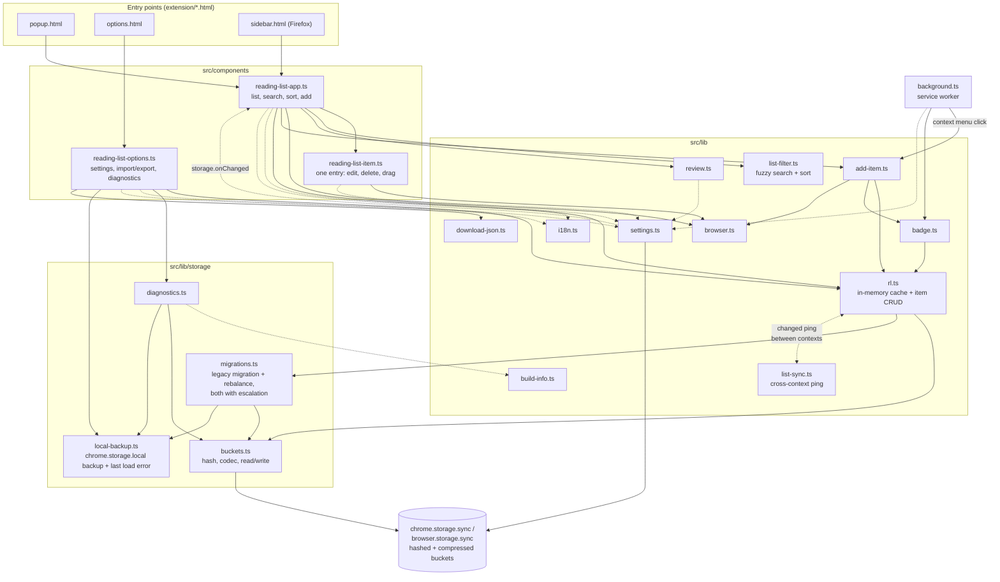
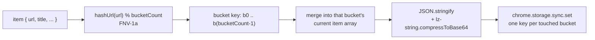

# AGENTS.md

Guidance for AI coding agents (Claude Code, or any other agent) working in this repository.

## Overview

This is a Chrome and Firefox browser extension for saving pages to read later. It uses Manifest V3, TypeScript, and Lit for web components. The extension is published on the Chrome Web Store and Firefox Add-ons.

## Architecture



Three HTML entry points, each mounting Lit components:

- **`extension/popup.html`** — the popup shown when clicking the extension icon, mounts `<reading-list-app>`
- **`extension/options.html`** — settings page, mounts `<reading-list-options>`
- **`extension/sidebar.html`** — Firefox sidebar panel, mounts the same `<reading-list-app>` bundle as the popup

Source (`src/`):

- **`src/background.ts`** — Manifest V3 service worker: context menu ("Add page to Reading List"), badge sync on tab activate/update, no persistent background context
- **`src/components/reading-list-app.ts`** — main list UI: search/filter/sort, add-current-page button, drag-and-drop reordering, staggered reveal animation, the edit-mode dimming overlay, the `_loadError` banner shown when the initial load fails (see Storage architecture). `render()` is split into `_renderHeader()`/`_renderSearch()`/`_renderControls()`/`_renderList()`, one private method per seam — keep new UI regions in their own method rather than growing one of these or reinflating a single monolithic `render()`.
- **`src/components/reading-list-options.ts`** — settings page: default-behavior checkboxes, export/import, Storage Diagnostics, "Download Local Backup", Clear Reading List
- **`src/components/reading-list-item.ts`** — a single list entry: inline title editing, slidein/slideout animations, delete/edit buttons
- **`src/styles/`** — every `css` stylesheet, deliberately kept separate from `src/components/` and named for **what each file styles, not which component imports it** (mirrors the pre-rewrite app's `src/style/base/*.styl` split more than a 1:1 file-per-component scheme would). Nine files, composed into components as needed via `static override styles = [...]`:
  - `theme.styles.ts` (below) and `reset.styles.ts` (box-sizing reset + the shared `:focus-visible` outline) go into **every** component.
  - `animations.styles.ts` — the `slidein`/`slidein-bounce`/`slideout` keyframes and the classes that trigger them. Only `reading-list-item.ts` uses it today; split out anyway since it's a distinct concern from the rest of the item's rules, same reasoning as the old app's `animations.styl`.
  - `app.styles.ts`, `header.styles.ts`, `search.styles.ts`, `controls.styles.ts` — all consumed by `reading-list-app.ts`, split by UI region (app shell/list spacing/sync-error/editing-overlay; header + save/settings/sidebar buttons; the search input; filter/sort tabs) rather than kept as one large file.
  - `item.styles.ts`, `options.styles.ts` — one file each for `reading-list-item.ts`/`reading-list-options.ts`, small enough not to need further splitting.
- **`src/styles/theme.styles.ts`** — **the single source of every color, shadow and shared typography value in the app** (`--rl-bg-color`, `--rl-page-bg-color`, `--rl-text-color`, `--primary-color`, `--rl-shadow`, `--rl-focus-color`, etc.), light and dark. Composed into every Shadow-DOM component as `static override styles = [theme, styles]`. **No component's own `*.styles.ts` may define a CSS custom property or a hardcoded color/hex/rgba literal** (`currentColor` and `transparent` are fine, they aren't colors to theme) — add a new token to `theme.styles.ts` and reference it with `var(...)` instead, even for a one-off/decorative color. This used to not be true — components each carried their own local, independently-drifting color variables (the options page alone had a low-contrast dark-mode bug from this) — the whole point of consolidating was a single place to fix a color and a single place to look for its value.
- Two files sit **outside every shadow root** and so can't `import` `theme.styles.ts` at all: `extension/shell.css` (the `popup.html`/`sidebar.html` page-shell CSS) and `extension/options.html`'s inline `<style>`. Both carry a literal, hand-duplicated copy of the relevant `theme.styles.ts` values with a comment pointing back to it — if you change a token in `theme.styles.ts` that's also used there (currently just the page background / text color), update both by hand. There's no build step tying them together.
- **`src/lib/rl.ts`** — the `RL` in-memory cache and item CRUD (see Storage architecture below)
- **`src/lib/storage/buckets.ts`** — bucket codec: hashing, keys, compress/decompress, read/write, `ListItemData`, and `bucketCountForItemCount()` (the bucket count is no longer a fixed constant — see Storage architecture)
- **`src/lib/storage/migrations.ts`** — legacy one-key-per-item migration and the bucket-count rebalance, both with retry-on-failure escalation (see Storage architecture)
- **`src/lib/storage/local-backup.ts`** — `saveLocalBackup()`/`getLocalBackup()` and `saveLoadError()`/`getLoadError()`, both backed by `chrome.storage.local` (10MB quota, a separate area from `chrome.storage.sync`) so they survive a `sync` quota failure
- **`src/lib/storage/diagnostics.ts`** — `getStorageDiagnostics()`, behind the Options → Advanced button, now also reports the last captured load error
- **`src/lib/download-json.ts`** — `downloadJson(filename, data)`, the shared Blob-and-`<a download>` mechanics behind Export and "Download Local Backup"
- **`src/lib/settings.ts`** — `Settings`, `DEFAULT_SETTINGS`, `getSettings()`, `updateSettings()`, and `onSettingsChanged()` (see Cross-context sync)
- **`src/lib/list-sync.ts`** — the "list changed" ping that keeps contexts in step (see Cross-context sync)
- **`src/lib/add-item.ts`** — build an item, add it, log failure, sync the badge; shared by the popup and the context menu
- **`src/lib/list-filter.ts`** — fuzzy search (Fuse.js) + sort/filter logic
- **`src/lib/badge.ts`** — sets the toolbar badge (✔) when the active tab's URL is already on the list
- **`src/lib/browser.ts`** — Firefox/Chrome detection, `getActiveTab()`, tab-opening helper
- **`src/lib/review.ts`** — synthetic "leave a review" nag list item (shown once, after 6+ saved items)
- **`src/lib/i18n.ts`** — thin wrapper over `chrome.i18n.getMessage`, backed by `_locales/`
- **`src/lib/build-info.ts`** — `BUILD_TAG`, read live from `chrome.runtime.getManifest().version`, surfaced as `Build: ...` in Storage Diagnostics. Exists so a stale/un-reloaded extension instance can be told apart from a real bug while debugging (this cost real time once — a popup instance kept open across an extension reload kept silently running old code). Reading it live from the manifest means it can't drift out of sync and updates automatically on every version bump.

`extension/shell.css` holds the page-shell CSS (`:root` tokens, reset, `body` typography, dark mode) shared by `popup.html` and `sidebar.html`, which are otherwise identical apart from the popup's fixed width and the `body` class.

**Relative imports carry `.js` extensions** (`import { x } from './storage/buckets.js'`), with `moduleResolution: "bundler"` in `tsconfig.json`. This is required once these modules import each other and are loaded as native ESM — dropping the extension breaks resolution outside the bundler (e.g. the Node test harness below). Keep it consistent; a single extensionless import is enough to break things in a confusing way.

## Storage architecture (`src/lib/rl.ts`, `src/lib/storage/`)

Items are **not** stored one key per bookmark. `chrome.storage.sync`/`browser.storage.sync` cap the item count at `MAX_ITEMS = 512` **keys**, regardless of value size — storing `{ [item.url]: item }` per bookmark (the original design) hard-caps the list at ~511 items even when the ~100KB byte quota has headroom left.

Instead, items are grouped into **hashed buckets** (key format `b${hash(url) % bucketCount}`), each holding a compressed array of items. This removes the per-item key cap; the real ceiling becomes the ~100KB total byte quota.

**The bucket count is not a fixed constant** (it used to be, `BUCKET_COUNT = 40` — see "A real quota-during-migration bug" below for why that changed). `bucketCountForItemCount()` in `buckets.ts` picks a starting guess from the current item count — `MIN_BUCKET_COUNT` (25) up to 150 items, 30 up to 250, 35 beyond that — and `migrations.ts` escalates up `BUCKET_COUNT_LADDER` (`[25, 30, 35, 40]`) if that guess's bucket write actually fails, rather than trusting the guess as final. Every size tier's starting guess deliberately stops one rung short of `MAX_BUCKET_COUNT` (40), so there's always at least one rung of real escalation room above it — see that section for the real collision that motivated this. The bucket count actually in effect is versioned via the `__bv` storage key, same as before; `rl.ts` caches it (`this.bucketCount`, refreshed on every load) so every mutator computes bucket keys consistently with whatever the last load settled on.

**Verified capacity is ~325 real-world items, not the ~1,200 once estimated.** That earlier number was based on synthetic test data averaging ~140 bytes/item (short, clean URLs, no query strings). Real saved items run closer to ~250 bytes/item raw once real URLs (search queries, tracking parameters) and real titles are counted — calibrated against an actual user's exported reading list. Importing a realistically-sized 1,100-item file gets **325 items** in before hitting the quota — confirmed identically in both Chrome and Firefox (ruling out a cross-browser quota-enforcement difference; an earlier theory that Firefox enforces quota more loosely didn't hold up once the same file was tested in both browsers instead of comparing against an old, much lighter synthetic file). `Storage Diagnostics` at that point: 95,432 of 102,400 bytes, 40/40 buckets used, largest bucket 6,142/8,192 bytes — **~294 bytes/item post-compression**, not the ~68 bytes/item the original fixed-`BUCKET_COUNT` rationale was calibrated against. **325 is the number to design and communicate around**, not ~1,200. One caveat: this reflects `bulkAddReadingItems`'s batch-of-25 stop-on-first-failure behavior (325 = 13 full batches), so the true byte-level ceiling is somewhat higher and one-at-a-time adds (not bulk import) aren't subject to the same batch-rounding.

**Bucketing + compression is confirmed to meaningfully help, independent of the ~325 vs. ~1,200 estimate mixup above.** A throwaway experiment branch (`flat-storage-experiment`) reverted `rl.ts` to the pre-bucketing scheme (one `chrome.storage.sync` key per item URL, no compression) and imported the exact same realistically-sized fixture used for the 325 result. Result: **225 items**, matching a byte-math prediction made before the test ran. So bucketing+compression is a real **~44% capacity win** (225 → 325) over flat storage at realistic item sizes, not an illusion created by the synthetic-data overestimate — it just helps less dramatically than the old ~1,200 figure implied. Worth knowing if `BUCKET_COUNT` or the storage scheme itself is ever reconsidered: the comparison data point exists, even though that branch itself was never merged.



Two non-obvious things to know before touching this code:

1. **Compression must be `compressToBase64`, not `compressToUTF16`.** `lz-string`'s `compressToUTF16` packs data into high-value UTF-16 code points to maximize density *per code unit* — but `chrome.storage.sync`/`browser.storage.sync` measure quota usage in real **UTF-8 bytes** (however they serialize for sync/persistence), and those code points mostly cost 3 bytes each in UTF-8. In practice this made `compressToUTF16` output use **~2.8x more real storage** than its JS string `.length` suggested — bad enough that it was no better than storing uncompressed JSON. `compressToBase64` is ASCII-only (1 byte per character), so it doesn't have this blowup, and nets a genuine ~35-40% size reduction. `decodeBucket()` tries base64 first and falls back to the UTF16 decoder, so buckets written before this fix still read correctly.
2. **The bucket count must stay small enough that each bucket holds many items.** LZ-style compression only pays off when there's redundant text within one blob (repeated property names, similar URLs). At 512 buckets, most buckets held only 1-4 items each — too little redundancy to compress well, plus fixed per-blob format overhead on every bucket. The `[25, 30, 35, 40]` ladder was chosen empirically as the range where each bucket's blob is big enough for compression to help while staying safely under the 8KB-per-bucket quota. If the ladder's values need to change again, that's safe — `rebalanceBuckets()` (below) re-groups everything under whatever count is actually settled on.

**Migrations run automatically inside `getListItems()`** (via `getItemsRemote()` → `loadAllBuckets()` in `migrations.ts`), in order:
1. **`saveLocalBackup()`** — if any legacy (pre-bucketing) items exist, snapshot them to `chrome.storage.local` *before* attempting anything else, unconditionally, every time. If this write itself fails, migration is skipped entirely rather than attempted blind — see "A real quota-during-migration bug" below.
2. **`migrateLegacyItems()`** — one-time move from the original one-key-per-URL layout into buckets, for anyone updating from before bucketing existed. Verifies each bucket's new key was written correctly before removing the legacy keys that moved into it, one bucket at a time (not all-at-once — see the caution below about why). Retried at the next rung of `BUCKET_COUNT_LADDER` if a bucket write fails; each retry re-reads whichever legacy keys are still unmigrated, since earlier buckets from a failed attempt may have already succeeded.
3. **`rebalanceBuckets()`** — versioned via the `__bv` storage key holding the bucket count last used. If it doesn't match `bucketCountForItemCount()`'s current guess for the actual item count, all existing items are re-read (works regardless of the old scheme, since it just scans any `b\d+` key), re-grouped, and written in one atomic `set()` call. Also retried up the ladder on failure, same as migration.

**Never loop a per-item write.** Each `addReadingItem`/`updateReadingItem` is its own `chrome.storage.sync.set()` call, and `storage.sync` rate-limits writes. Even at the realistic few-hundred-item capacity this design allows (see above), `for (item of items) await rl.updateReadingItem(...)` means hundreds of sequential writes. This shape has appeared twice: in `importList()` and in drag-reorder. Both now group items by bucket and write each bucket once — `rl.bulkAddReadingItems(items)` (chunked) and `rl.reorderItems(urls)` (a single `set()`). Reuse `groupItemsByBucket()` rather than adding a third copy of that logic.

A caution from getting this wrong once: an import failing partway through with `QuotaExceededError: storage.sync API call exceeded its quota limitations` was diagnosed as a write-rate throttle and "fixed" with retry/backoff. The real cause was the `compressToUTF16` byte accounting above — it was the `QUOTA_BYTES` ceiling, hit early because every item cost ~2.8x what it appeared to. Retrying a full quota can never succeed, so the retries only delayed the failure report; they've since been removed. That error message does not distinguish which quota was hit, so **use the Storage Diagnostics button to find out which limit you're actually against before theorising.**

**`updateReadingItem` skips no-op writes.** It returns early when every key in `updates` already equals the current value, because `background.ts` calls it with `{viewed: true}` on every tab activation and would otherwise re-write the bucket on every switch to an already-viewed saved page.

**The mutators lazily initialize.** `addReadingItem`/`removeReadingItem`/`updateReadingItem` call `getListItems()` themselves if needed. They used to silently `return` when uninitialized, which made `viewed` tracking depend on `handleTabUrl` happening to call `syncBadgeForTab()` (and thus `getListItems()`) first — reordering two lines would have broken it with no error.

**Any code path that writes to storage outside `rl`'s own methods must also update `rl`'s in-memory cache**, or go through `rl`. `rl` is a per-page singleton (`export const rl = new RL()`) holding `this.list` + `this.initialized`; `getListItems()` only re-fetches from storage when `!this.initialized`. `_onResetClick()` used to call `chrome.storage.sync.clear()` directly, which left the in-memory cache stale — Export right after Clear would return the old cached list even though storage was actually empty. Use `rl.clearAll()` instead, which clears storage and resets the cache together.

**`getStorageDiagnostics()`** (wired to the "Storage Diagnostics" button in Options → Advanced) reports item/bucket counts and both `chrome.storage.sync.getBytesInUse()` (the browser's real number) and a manual UTF-8-byte estimate side by side. If those two numbers ever diverge significantly again, that's the fastest way to catch another byte-accounting bug like the one above — trust `getBytesInUse()` over any hand-rolled estimate.

**The old-extension → this-extension auto-update path is verified safe.** A real user's exported `chrome.storage.sync` from the pre-rewrite (`reading-list-old`, Manifest V2) extension — one key per item URL, a separate `settings` key, matching old's actual write shape confirmed by reading its source — was seeded into the mocked storage from `AGENTS.md`'s established Node-script pattern and run through `getListItems()`. Result: all items survive with every field intact, `settings` is left completely untouched (`legacyKeys` detection in `migrations.ts` is `/^https?:\/\//i`, which `settings` never matches), legacy per-URL keys are removed only after the new bucket keys are written and verified, and a second `getListItems()` call is a no-op (no re-migration, no duplication). Also verified: an item missing `index`/`viewed` entirely (both are optional on `ListItemData`) migrates without error, for any install old enough to predate those fields. This test used real personal browsing history from one export, so neither the fixture nor the script were committed — same as every other Node-script verification this session, which stayed in the scratchpad rather than the repo. Re-derive it the same way (real or synthetic seed data, mocked `chrome.storage.sync`, dynamically `import()` the compiled `rl.js`) before ever changing `migrateLegacyItems()` or the legacy-key detection regex. Cross-checked live in a real Firefox install too: seeded a bare old-shaped item (no `index`/`viewed`) plus a `settings` key via the popup's own devtools console, reopened the popup, and confirmed the item rendered correctly, `chrome.storage.sync` held exactly `__bv` + one `b<N>` bucket key + the untouched `settings` key, and the legacy URL key was gone.

### A real quota-during-migration bug, the investigation, and the fix (3.2)

A real user reported (by email) that after updating, their list showed empty, Add and Export did nothing, and there was no error anywhere. Root cause: `migrateLegacyItems()`'s bucket writes had no error handling, so a `QuotaExceededError` on any one bucket propagated as an uncaught rejection through `getListItems()` — silently breaking the list view, Add, and (at the time) Export together, with nothing surfaced anywhere. Never confirmed which exact mechanism hit their specific account, since no diagnostics were collected before the fix shipped (see the statistics paragraph below for why "a single bucket organically overflowing" is a poor bet as their actual cause, even though it's what all of the work below defends against).

**Real per-bucket collisions are astronomically rare to happen organically, don't build more defense than this class of bug deserves.** A single bucket exceeds its real 8192-byte cap around 104+ realistic items (varies with how compressible the content is). At the real-world average load (~8 items/bucket at the documented 325-item capacity), the Poisson-tail probability of any bucket organically reaching that is on the order of 10⁻⁷⁵ to 10⁻⁹⁵ — for scale, the observable universe has roughly 10⁸⁰ atoms. Confirmed this is genuinely that improbable, not a modeling error, by trying to construct a failing test case: it took deliberately reverse-engineering `hashUrl()`/`bucketKey()` in a standalone script and brute-forcing thousands of candidate URLs to find ones that hash into the same bucket (see "To deliberately reproduce a single-bucket collision" under Build and Development) — no organic dataset does this by accident. A dynamic bucket count that grows with list size (an earlier idea considered here) doesn't change this calculus either — it's a compression tuning, not a collision defense, and was documented as such rather than removed once that was clear. The real, durable fix is what shipped: make a real failure (however it happens) recoverable and diagnosable, not try to make the failure itself impossible.

**The fix, in the order it actually runs (`migrations.ts`, `local-backup.ts`):**
1. **Back up to `chrome.storage.local` first, unconditionally, every time there's legacy data to convert** — before migration is ever attempted, success or failure. `chrome.storage.local` has a 10MB quota, a completely separate area from the ~100KB `sync` quota that's failing, so the backup is unaffected by whatever's about to go wrong. If this backup write itself fails (rare, but checked), migration is skipped entirely rather than attempted blind — `loadAllBuckets()` throws immediately with a message telling the user to export from Options, and nothing in `sync` storage gets touched.
2. **Escalate up `BUCKET_COUNT_LADDER` on an actual write failure**, not just accept the size-based guess (see the Storage architecture intro above). Verified against a real 150-item, single-bucket collision and a real 300-item one: both resolve cleanly by retrying at the next rung, with zero data loss or duplication either way.
3. **If the ladder is genuinely exhausted, fail loud, not silent.** `saveLoadError()` records the real error (name, message, timestamp) to `chrome.storage.local`; `reading-list-app.ts` catches the rejection from its constructor's `Promise.all(...)` and sets `_loadError`, rendering a banner that says conversion failed and points at Options — deliberately **no button in the popup itself**, redirecting to Options → Advanced instead, since that's also where the "Download Local Backup" button lives and duplicating it in two places wasn't worth it.
4. **`getItemsReadOnly()` (`migrations.ts`) bypasses migration and rebalancing entirely** — reads whatever's in storage as-is (decoded buckets plus any still-unmigrated legacy items), no writes, can't fail the way `getItemsRemote()` can. `exportList()` in `reading-list-options.ts` uses this instead of `rl.getListItems()`, so Export works even while the list view is broken. "Download Local Backup" (Options → Advanced) prefers the `chrome.storage.local` snapshot from step 1 and falls back to this if none exists.
5. **`getStorageDiagnostics()` reports the last captured load error** alongside its existing item/bucket/byte counts, so "what actually broke" is answerable from the UI instead of requiring a console.

## Cross-context sync

The popup, sidebar, options page and service worker are separate page contexts. Each loads its own copy of the modules, so each has its own `RL` singleton with its own `this.list`. Nothing about `chrome.storage.sync` notifies one context that another wrote, so without explicit syncing a write in one leaves every other stale — most visibly in Firefox, where the sidebar stays open while you browse.

Two mechanisms, deliberately different:

**Item changes use one payload-free ping** (`src/lib/list-sync.ts`). Every `RL` mutator calls `broadcastListChange()` after it writes. A receiving context sets `initialized = false`, re-reads from storage, and notifies subscribers — that is the entire handler, with no per-change-type logic. `chrome.runtime.sendMessage` does not deliver back to the sending context, so a context never reacts to its own writes.

**Settings use `chrome.storage.onChanged`** (`onSettingsChanged()` in `src/lib/settings.ts`). They live under one small `settings` key whose change event already carries `newValue`, so there's nothing to re-read, and `onChanged` picks up every writer automatically — including the options page — so nobody has to remember to broadcast. This is what keeps sort and all/unread in step between views.

### Why a ping rather than typed deltas

A delta version was built and measured (broadcasting `add`/`remove`/`update`/`reload` and applying each to the cache). It avoided the re-read, but it was ~50% more code and, more importantly, a mutator that forgot to broadcast would drift silently and permanently. With the ping there is one message shape and one code path, and a missed broadcast self-heals the next time anything else changes. That robustness is the reason for the choice, not the line count.

The cost is real but small: a full `get(null)` plus decompressing every bucket per change, in non-originating contexts only — measured at ~10ms median (23ms worst case) for 1,000 items. Don't "optimize" this back into deltas without a measured reason.

### Traps in this area

- **A removal arriving from another context must never reach `delete-item` / `rl.removeReadingItem()`.** That's the *local* delete path; routing a synced removal through it writes the deletion to storage a second time and re-broadcasts it. `reading-list-item.ts` keeps a `_localDelete` flag so the shared `slideout` animation can end in one of two events: `delete-item` for a real click, `remove-animation-end` for a remote removal, which only drops it from local state.
- **The component detects removals by diffing**, since the ping carries no payload: it compares its previous `_listItems` against the freshly re-read list. Urls that disappeared animate out, urls that appeared slide in. A side benefit is that this catches changes from any source, not only ones that remembered to broadcast.
- **Animating a synced removal means rendering an item that no longer exists in `rl.list`** — the component holds it as a ghost in `_listItems` until the animation finishes. Two ways that got stuck, both now guarded, and both produced the same symptom, *a deleted item reappearing when the search was cleared*:
  - the item was filtered out of view, so no element existed to animate and `animationend` never fired. The decision to animate therefore tests the **visible** set (`_visibleItems`), not the full list.
  - the item was hidden by a search/filter change *mid*-animation, cancelling it with no event. A timeout finalizes the removal as a fallback.
- **Node tests don't cover any of this.** The mocks define `chrome.storage.sync` but not `chrome.runtime` or `chrome.storage.onChanged`, so registration must be guarded (it is, via optional chaining) or every test fails at import — `RL`'s constructor registers at module load. Animations and DOM lifecycle can only be checked in a browser.
- **Every component showing settings must subscribe to `onSettingsChanged`**, not just read them once on connect. Both `reading-list-app.ts` and `reading-list-options.ts` do. The options page originally didn't, so its checkboxes went stale whenever a setting changed in another context. Subscribe in `connectedCallback` (releasing any previous subscription first — it can fire more than once) and unsubscribe in `disconnectedCallback`.
- **`.reading-list-item.slideout` needs `animation-fill-mode: forwards`.** Without it, the instant the animation ends the browser discards its final keyframe and the element snaps back to fully visible until something else changes the DOM. That's harmless for a *remote* ghost removal (`_onRemoteRemoveAnimationEnd` → `_finishRemoval` is synchronous, no gap for a reverted frame to paint), but a *local* delete has a real async gap there (`_onDeleteItemClicked` awaits `rl.removeReadingItem()` before updating `_listItems`), long enough for the browser to paint the reverted frame — the just-deleted item flashing back for a frame or two before actually disappearing. Confirmed by page-tagged console logging across both windows simultaneously: two earlier theories (a cross-context storage race, then `chrome.runtime.sendMessage` self-delivering to its own sender) were each investigated, built fixes for, and directly disproven this way before finding the real cause — see `architecture-audit_v3.md` if it still exists locally for that history.

## Build and Development

### Commands

```bash
npm install           # Install dependencies
npm run build          # rm -rf extension/scripts build && tsc && rollup -c — compiles TS to extension/scripts/, bundles to build/
npm run format          # Format code with Prettier
npx tsc --noEmit         # Fast typecheck only, skips the Rollup bundle step — use this while iterating
```

**`npm run build` cleans both output directories first.** Neither `tsc` nor `rollup -c` do this on their own — each just writes/overwrites whatever the current source produces, leaving anything from a *previous* source layout untouched. A file move (e.g. `src/components/theme.styles.ts` → `src/styles/theme.styles.ts`) left the old compiled output sitting alongside the new one in `extension/scripts/components/`, and a shared Rollup chunk that stops being shared after an import-graph change leaves its old chunk file (e.g. a stale `build/state.js`) behind too — silently shipped in every zip packaged afterward, since nothing removes it, and both looked like real output right up until a clean rebuild was compared against one. Harmless at runtime (nothing references an orphaned file, so it never executes) but it inflates the package and can misattribute a `web-ext lint` warning to a file that isn't even part of the current bundle. If `build/` or `extension/scripts/` ever look wrong, `rm -rf` both and rebuild before trusting what's there.

There is no automated test suite (`npm test` is a stub). For logic that touches `chrome.storage.sync` (`rl.ts` and `lib/storage/`), the established pattern is: compile with `npm run build`, then run a small Node script that sets `globalThis.chrome.storage.sync` to an in-memory mock (get/set/remove/clear/getBytesInUse) and dynamically `import()`s the compiled output under `extension/scripts/lib/` directly — no browser needed.

Two things make these mocks worth writing carefully:
- **Enforce the real quotas.** A mock that also enforces `QUOTA_BYTES`, `QUOTA_BYTES_PER_ITEM` and the write-rate limit (throwing the same `QuotaExceededError` shape) is what caught both the bucket-count and compression-encoding bugs. A permissive mock passes and hides real quota problems. Mock `chrome.storage.local` too (a second, separate in-memory store, no quota enforcement needed since 10MB is never realistically hit) whenever the code under test touches `local-backup.ts`.
- **Count `set()` calls.** Asserting on the number of write operations is how the per-item-write bugs above get caught before they ship.

**To deliberately reproduce a single-bucket collision** (not something that happens with organic data — see "A real quota-during-migration bug" above): replicate `hashUrl()`/`bucketKey()` from `buckets.ts` in a standalone script, then brute-force-generate candidate URLs (varying a counter) and keep only the ones whose hash lands on a specific target bucket at a specific bucket count. Expect to scan thousands of candidates to find ~100+ matches, since the hash spreads close to uniformly. Always verify the resulting fixture against the *real* compiled `encodeBucket()` (not an estimate) before trusting it — compression ratio varies a lot with how repetitive the URLs/titles are, so a fixture that overflows at one bucket count with one content style may not with another; recompute rather than assume.

### Testing a real browser update flow (old version → broken → fixed)

For anything touching migration, this is the only way to catch what Node mocks can't: real `chrome.storage.sync`/`browser.storage.sync` behavior, real extension-update semantics, and whether a fix actually shows up correctly in the UI, not just returns the right data.

**Folder convention** (gitignored, not committed): `tmp/test/firefox-test/` and `tmp/test/chrome-test/`, each with `old/`, `before-fix/`, `new/`, and an empty `live-test/` that gets overwritten and reloaded at each step rather than re-picking a folder every time:
```bash
rm -rf tmp/test/firefox-test/live-test/* && cp -R tmp/test/firefox-test/new/. tmp/test/firefox-test/live-test/
```
Load/reload `live-test/` itself in the browser, never `old/`/`before-fix/`/`new/` directly, so those stay clean reference copies you can re-copy from at any point without rebuilding.

**Firefox**: `old/` is the real `reading-list-old` (Manifest V2) build. `before-fix/` and `new/` are this repo built at different points (e.g. `git worktree add --detach <path> <commit-or-branch>` to build an older commit without touching the current branch's uncommitted work, then remove the worktree after copying `build/` out). All three need the **same** `browser_specific_settings.gecko.id` in their `manifest.json` (a dedicated test-only id, never the real published one) — Firefox's `storage.sync` is scoped per extension id, so a mismatched id means each load is treated as a separate, unrelated extension and there's nothing to migrate. A temporary/unpacked Firefox install needs this id explicitly set at all (`storage.sync` silently doesn't work otherwise).

**Chrome**: current Chrome refuses to load real Manifest V2 at all ("Cannot install extension because it uses an unsupported manifest version"), so there's no real "old" build to test against directly — use this repo's own historical `v3` branch (early MV3, pre-bucketing, same flat one-key-per-item storage the real old extension used) as the stand-in, again via a `git worktree` build. Chrome's unpacked-extension id is stable per folder path across "Reload," so no manifest id juggling is needed there.

**Always do a full remove-and-reload**, not a soft "Reload," when swapping `live-test/`'s contents — both browsers can keep a previously-opened popup's old JS running across a same-folder reload (a real, repeatedly-hit trap this session), which looks exactly like a code change not having taken effect.

### Full package + verify workflow

After a change to anything under `src/` or `extension/`, this is the loop used throughout this project:

```bash
npm run build
rm -f dist/reading-list-chrome.zip
(cd build && zip -r -q -X ../dist/reading-list-chrome.zip . -x '*.DS_Store')
npx web-ext build --source-dir=build --artifacts-dir=dist --overwrite-dest --filename=reading-list-firefox.zip
npx web-ext lint --source-dir=build
```

### Loading into Browser

**Chrome:**
1. Go to `chrome://extensions/`
2. Enable "Developer Mode"
3. Click "Load unpacked" (first time) → select the `build` folder, or click the reload icon (↻) on the extension's card thereafter
4. Chrome does **not** auto-reload an unpacked extension when files on disk change — always click reload after rebuilding

**Firefox:** `about:debugging#/runtime/this-firefox` → "Load Temporary Add-on" (accepts either the `build` folder's `manifest.json` or `dist/reading-list-firefox.zip`) → click "Reload" on the same entry after rebuilding; it re-reads from whichever path/file you originally loaded.

## Key Implementation Details

- **Manifest V3**: service worker, no persistent background context. The manifest's `content_security_policy.extension_pages` only honors a narrow set of directives (`script-src`, `object-src`) — `script-src-attr` is silently discarded, so inline event-handler attributes (e.g. `onerror="..."`) get blocked by Chrome's platform-default CSP instead. Use Lit `@event` bindings, never inline handlers.
- **Firefox minimum version is deliberately 140.0** (`browser_specific_settings.gecko.strict_min_version`, `142.0` for `gecko_android`), higher than it needs to be for anything the code actually uses. It's pinned there because `browser_specific_settings.gecko.data_collection_permissions` (required by Firefox on all new/updated extensions; this one declares `required: ["none"]` since it collects nothing) isn't recognized before those versions — declaring it on an older `strict_min_version` produces its own lint warnings. Don't lower `strict_min_version` without also reconsidering that key.
- **Adding Trusted Types CSP does not silence `web-ext lint`'s `UNSAFE_VAR_ASSIGNMENT` warnings.** Verified directly: `require-trusted-types-for 'script'; trusted-types lit-html` was added and rebuilt, warning count was identical before and after, then reverted. These warnings come from lit-html's own bundled template-instantiation code (`<template>.innerHTML = ...`, used to parse each tagged template's static HTML via the browser's native parser) wherever it lands in the Rollup output, not a sign our own code is doing this. `addons-linter` is a static source scanner with no concept of trusted-type wrapping; there is no CSP or code change in this repo that removes them short of dropping Lit. Leave them. **Which files they land in isn't stable** — Rollup names each shared chunk after one of the modules inside it, and that assignment shifts whenever the import graph between entry points changes (e.g. one more `.styles.ts` file becoming shared by a new combination of components can add or move a chunk and its warning). Check `npx web-ext lint --source-dir=build --output=json` for the current file/count rather than trusting a number written down here.
- **Storage**: see Storage Architecture above.
- **Context Menu**: `chrome.contextMenus` API, toggled by the `addContextMenu` setting.
- **Firefox `page_action`**: deliberately **not implemented**. Chrome removed `page_action` entirely in MV3; Firefox still supports it but has stated intent (since ~2022, still not done as of this writing) to eventually merge it into `action`. Decided not worth building on a soon-to-be-deprecated API — re-verify current status before reconsidering.
- **Web Components**: Lit, TypeScript decorators, reactive properties.
- **i18n**: `_locales/` + `src/lib/i18n.ts`.
- **Settings**: defaults live in one place, `DEFAULT_SETTINGS` in `src/lib/settings.ts`. `getSettings()` merges them and returns `Required<Settings>`, so callers read `settings.animateItems` directly — don't reintroduce `?? true` fallbacks at call sites.
- **Dark mode**: driven entirely by `theme.styles.ts`'s own `@media (prefers-color-scheme: dark)` block re-assigning its tokens — components consume `var(--rl-...)` and never need their own dark-mode color overrides (see the theme-tokens bullet above). A component *can* still have its own `@media (prefers-color-scheme: dark)` block for a **structural** choice that isn't just "which color" — e.g. the options page's buttons deliberately swap from `var(--primary-color)` to `var(--rl-bg-color)` in dark mode (an intentional desaturate, matching the same pattern on the popup's save button), which is a different token being selected, not a token being redefined. When adding a dark-mode override for a selector that also has a base (light-mode) rule, put the dark block **after** the base rule in source order — a dark-mode override placed before an equal-specificity base rule is silently always beaten by it, regardless of whether the media query matches (this bit the options-page button colors once already). The same ordering applies across the `static styles = [theme, styles]` array: later entries win ties, so a component's own declarations override `theme.styles.ts`.
- **Centering a single glyph/icon in a flex button: use `padding-bottom`, not `transform: translateY()`.** A raw text glyph's line box often carries more space above the ink than below (font metrics, not something `line-height: 1` reliably fixes), so it visually sits low. `transform` on the button moves the *entire* button — background circle and glyph — as one rigid unit, so it can never fix an offset that's internal to the glyph's own box; it only proved that a style change was reaching the page during debugging. `padding-bottom` on the flex container reshapes the content area around the (unmoved) box, which actually recenters the ink. Dial the exact value in DevTools live (force the `:hover`/`:focus-visible` state open in the Rules panel if it's a hover-only effect) rather than guessing pixel values — see `.save-button`/`.settings-button` (in `header.styles.ts`) and the edit-button's hover circle (in `item.styles.ts`) for worked examples.
- **Dimming "other" content while one item is being edited uses a real overlay, not `opacity`.** `reading-list-app.ts` renders a single `.editing-overlay` (`rgba(0,0,0,0.4)`, ported from the pre-rewrite app's exact technique) covering the whole component when `_editingUrl !== null`, with the item actually being edited lifted above it via `.editing { z-index: 11 }` vs. the overlay's `z-index: 10`. An earlier version used `opacity: 0.5` on each non-editing item instead — `opacity` blends an element toward *whatever's behind it*, and since items sit on a near-white background, this made locked items slightly *lighter*, not darker, and never dimmed the page background around/between items at all. The overlay lives inside `reading-list-app`'s shadow root, so it can only cover `:host`'s own box by default; `.editing-overlay`'s `inset: -1rem` deliberately bleeds past that to also reach `<main>`'s `padding: 1rem` in `popup.html`/`sidebar.html`, which sits *outside* the shadow boundary. If that padding value ever changes, this inset needs to change with it.

## Current Feature Status

See `README.md` for the feature checklist.

## TypeScript Configuration

- Target: ES2021
- Strict mode enabled
- Output: `extension/scripts/`
- Uses `ts-lit-plugin` for Lit template type checking
- `experimentalDecorators` (required by Lit's `@customElement`/`@state`/etc.) + `importHelpers: true`, with `tslib` as a direct dependency. Without `importHelpers`, `tsc` inlines its own `__decorate` helper into every compiled file, guarded by a `this && this.__decorate` UMD-style check meant for non-ESM output — in a real ES module, top-level `this` is `undefined`, so Rollup rewrites it and warns on every single build (`` `this` has been rewritten to `undefined` ``). `tslib`'s helper has no such guard, so pointing `tsc` at it removes the warning and, as a side effect, shares the helper across files instead of duplicating it into each one.
