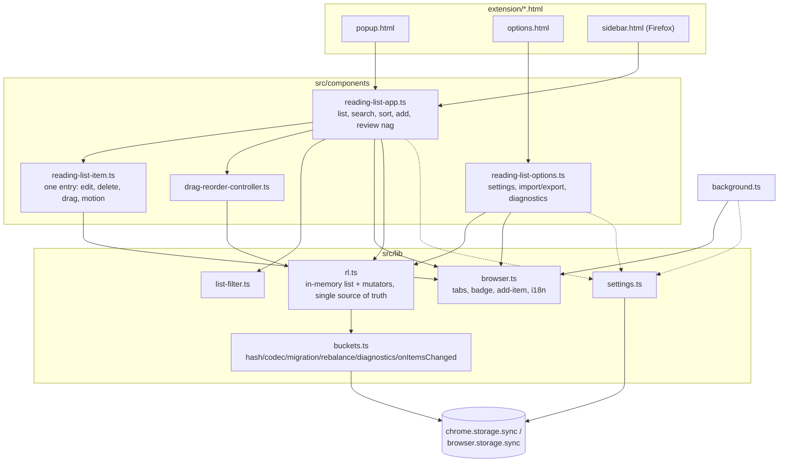

# AGENTS.md

Guidance for AI coding agents working in this repository: a Chrome/Firefox Manifest V3 extension for saving pages to read later, built with TypeScript and Lit.

## Architecture



- **`src/background.ts`** — service worker: context menu, badge sync on tab activate/update.
- **`src/components/reading-list-app.ts`** — main list UI, the review nag (`maybeGetReviewItem`/`dismissReview`, merged in here since it has no other caller), staggered initial reveal, per-item motion options.
- **`src/components/reading-list-options.ts`** — settings, export/import (including `downloadJson`, merged in here), Storage Diagnostics, local backup, clear.
- **`src/components/reading-list-item.ts`** — one entry: inline edit, drag start, its own enter animation.
- **`src/components/drag-reorder-controller.ts`** — drag/drop reactive controller for the list.
- **`src/lib/rl.ts`** — the `RL` singleton: in-memory list, subscribers, mutators. See Storage below.
- **`src/lib/buckets.ts`** — everything storage: hashing, bucket keys, the lz-string codec, migration, rebalancing, `onItemsChanged`, diagnostics, local backup. One file; see below for why.
- **`src/lib/browser.ts`** — Firefox/Chrome detection, tab helpers, badge sync, `addReadingItemAndSyncBadge`, `i18n` (all merged here; none had enough surface area to justify a separate file).
- **`src/lib/settings.ts`**, **`src/lib/list-filter.ts`** — unchanged in shape from before this refactor.
- **`src/styles/`** — `theme.styles.ts` (colors/tokens + the box-sizing/focus-visible reset, used by every component) and `app.styles.ts` (shell/header/search/controls, all consumed only by `reading-list-app.ts`) are each one file now; `item.styles.ts` and `options.styles.ts` stay separate, one per their single consumer.
- **No code comments anywhere in `src/`.** Names carry the meaning; reasoning lives here.
- Relative imports carry `.js` extensions (`moduleResolution: "bundler"`); required once modules import each other as native ESM (the Node test harness runs this compiled output directly, unbundled).

## Storage (`src/lib/buckets.ts`, `src/lib/rl.ts`)

**Decision:** items live in hashed buckets (`b${hash(url) % bucketCount}`), a compressed array per key, not one `chrome.storage.sync` key per item.

**Reason:** `storage.sync` caps the item **count** at 512 keys regardless of size — one key per bookmark hard-caps the list at ~511 items long before the ~100KB byte quota is the real limit. Bucketing removes the per-item key cap; compression (`lz-string.compressToBase64`) then buys real headroom on top of that, since compression only pays off when there's redundant text within one blob.

**Numbers:**
- Bucket count is a **guess re-derived from item count every load** (`bucketCountForItemCount`: 25 up to 150 items, 30 up to 250, else 35), escalated up `[25, 30, 35, 40]` (`withLadder`) if the guess's actual write fails. Every tier's guess stops one rung short of 40 on purpose, so there's always a rung to retry into. The count in effect is versioned via `__bv`.
- **Compression must be `compressToBase64`, never `compressToUTF16`.** UTF16 packs into high-value code points that cost ~3 bytes each once serialized for sync, ~2.8x more real storage than `.length` suggests — this alone caused a real `QuotaExceededError` once, misdiagnosed as a write-rate problem before the byte accounting was found. `decodeBucket` still falls back to UTF16 for buckets written before this fix.
- **Real capacity is ~325 items**, not ~1,200 — that estimate came from synthetic ~140-byte items; real URLs/titles run ~250 bytes raw, ~294 bytes/item post-compression. Confirmed identically in Chrome and Firefox. Bucketing+compression is still a real, measured ~44% capacity win over flat one-key-per-item storage (225 vs 325 items on the same realistic fixture) — it just helps less than the old estimate implied.
- A single bucket exceeding its 8192-byte cap needs 100+ realistic items in it; at realistic load (~8 items/bucket) the odds of that happening organically are astronomically small (worked the math and tried to construct a counterexample — see git history for the brute-force recipe if you need to build one deliberately).

**How a load resolves** (`buckets.ts`'s `loadItems`, called from `rl.getListItems()`): read everything; if legacy (pre-bucket, one-key-per-URL) items exist, back them up to `chrome.storage.local` **unconditionally, before anything else** (a completely separate 10MB quota, unaffected by whatever's about to go wrong in `sync`) — if that backup write itself fails, migration is skipped rather than attempted blind; migrate legacy items bucket-by-bucket (write, then remove that bucket's legacy keys — no read-back verification, a real `set()` throwing is trusted over a redundant read); if the resulting bucket count doesn't match what the current item count naturally implies, rebalance (re-group everything, one atomic `set()`). Both migration and rebalance retry through the same `withLadder` helper. Any failure that survives the ladder is recorded via `saveLoadError` (`chrome.storage.local`) and rethrown — `getListItems()` rejects, but `readItemsReadOnly()` (raw scan, no migration, can't fail this way) and Storage Diagnostics both still work.

**Public API** (nothing outside this file may touch hashing/keys/the codec/`__bv`/the ladder/the `b\d+` regex): `loadItems()`, `saveItems(all, touchedUrls)` (re-groups only the buckets containing a touched URL and writes/removes just those), `clearItems()`, `readItemsReadOnly()`, `onItemsChanged(cb)`, `getStorageDiagnostics()`, `getLocalBackup()`. `test/helpers/{bucket-layout,collision}.mjs` reach into a `testOnlyInternals` export for white-box verification; nothing in `src/` does.

**`rl.ts`** holds only the list, subscribers, and mutators. Every mutator updates `this.list` then calls a private `persist(touchedUrls)`, the one path that calls `saveItems` and reports success/failure uniformly; a failure rolls `this.list` back. `persist` (and `clearAll`) notify subscribers on every outcome, success or rollback — `rl.subscribe` is the **only** channel a UI needs, for a local change or a remote one. Mutators lazily call `getListItems()` themselves if needed (including `bulkAddReadingItems`, which used to refuse to run before an explicit load — no longer a special case). `updateReadingItem` skips a no-op write (matters because `background.ts` calls it with `{viewed: true}` on every tab activation). Reorder and bulk-import group by bucket and write once per touched set, never once per item — `storage.sync`'s 120-writes/minute cap makes a per-item loop a real risk at only a few hundred items.

**Traps:** rebalancing is triggered purely by "does the natural guess match `__bv`," with no check for whether the current layout already fits and no memory of *why* a stored count differs from the guess — a list that's escalated past its natural guess will keep re-attempting (and re-paying the cost of) a rebalance down to that guess on every single load, forever. See the refactor plan's Bugs-found notes if you're touching this.

## Cross-context sync

**Decision:** `onItemsChanged` (`buckets.ts`) wraps `chrome.storage.onChanged`, filtered to `b\d+` keys, and is what `rl`'s constructor subscribes to. There is no more separate ping mechanism.

**Reason:** a payload-free `runtime.sendMessage` ping (the previous approach) never reaches the sending context, so every context could safely re-read on any ping without special-casing its own writes. `storage.onChanged` does **not** have that property — it fires in the writing context too — so `onItemsChanged` has to actively ignore a change whose `newValue` matches what this context itself just wrote. A small map (`lastWrittenByThisContext`) records every outgoing `set()`/`remove()` **before** the call, not after: a storage change event can fire synchronously inside the mock's (and plausibly a real browser's) `set()` call, before that call's own promise even resolves back to its caller — recording after the `await` lost that race once and caused a mid-migration reentrant reload loop that burned through the write-rate limit on a 20-item fixture. `test/cross-context-sync.test.mjs` pins this down: an own write notifies subscribers with zero re-fetch from storage; a foreign write causes exactly one re-fetch and one notification.

**Side effect worth knowing, not a deliberate feature:** `chrome.storage.onChanged` fires for changes synced in from another *device*, not just another context on the same device the way `runtime.sendMessage` did. Open popups/sidebars now pick up a change made elsewhere once sync delivers it.

Settings still use `chrome.storage.onChanged` directly in `settings.ts`, unrelated to `onItemsChanged` (different key, no bucket filtering needed) — both are independent listeners on the same underlying event.

## Animation

**Decision:** `@lit-labs/motion`'s `animate()` directive, keyed off `repeat()`, drives every entry/exit and reorder animation. There is no hand-written ghost-item tracking, `_localDelete` flag, `remove-animation-end` event, or `animation-fill-mode` bookkeeping — `animate()` keeps a removed element in the DOM for its own exit animation automatically, so the component never needs to know *why* an item left the list.

**Shape:** each `reading-list-item` is really two animated targets. The outer card (`reading-list-app.ts`, `_itemMotionOptions`) plays `OUTER_CARD_SLIDE_IN_KEYFRAMES`/`OUTER_CARD_SLIDE_OUT_KEYFRAMES` on entry/exit and a `top`-position FLIP on reorder; the inner `.item-content` (`reading-list-item.ts`, `_contentMotionOptions`) plays its own slower bounce-in (`INNER_CONTENT_BOUNCE_IN_KEYFRAMES`) at the same time, with no separate exit variant — only the outer card animates out. Reorders use a faster timing (`ITEM_DRAG_FLIP_TIMING`, 180ms) than enter/exit (`ITEM_ENTER_EXIT_TIMING`, 220ms). The item actively being dragged sets `disabled: true` on its own outer motion options so the library's position animation doesn't fight the browser's native drag feedback. The staggered reveal on first load (`_staggerReveal`/`_revealedUrls`) is separate, app-level orchestration deciding *when* each item enters `_visibleItems` — the per-item entry animation itself is unaware of it.

## Build and Development

```bash
npm install
npm run build            # rm -rf extension/scripts build && tsc && rollup -c
npm run format
npx tsc --noEmit          # fast typecheck only
npm test                  # pretest runs `npm run build`, then node --test test/*.test.mjs
npm run test:gen-fixtures     # regenerate test/fixtures/*.json from real shipped versions (git worktree + tsc)
npm run test:update-snapshots # regenerate test/expected/*.json after an intentional storage-layout change
```

`npm run build` cleans both output dirs first — neither `tsc` nor `rollup` do on their own, so a stale file from a previous layout can otherwise linger and ship silently.

**`test/`** is a real, automated `node:test` suite (not a one-off script) exercising the compiled output under `extension/scripts/lib/` directly against a `chrome.storage` mock (`test/mock-chrome.mjs`) that enforces `QUOTA_BYTES`, `QUOTA_BYTES_PER_ITEM`, and the write-rate limit the same way Chrome does, and provides a real `chrome.storage.onChanged`. It covers fixture loads (legacy/v3.1/v3.2 shapes, generated from the real shipped code at those commits), migration and its escalation ladder, every mutator's write count, quota-limited imports, and the cross-context suppression behavior above. `test/lib-paths.mjs` is the one file to update when storage code moves again. Run it before trusting any change to `rl.ts` or `buckets.ts`.

**To deliberately reproduce a single-bucket collision** for a test: replicate `hashUrl`/bucket-key logic (or use `testOnlyInternals` from a compiled build) and brute-force candidate URLs, keeping only the ones landing on a target bucket at a target count — expect to scan thousands to find ~100+ matches. Always verify against the real `encodeBucket()`, not an estimate; compression ratio depends on how repetitive the content is.

## Key Implementation Details

- **Manifest V3**: service worker, no persistent background context. Inline event-handler attributes are blocked by CSP — use Lit `@event` bindings.
- **Firefox minimum version 140.0** (`gecko.strict_min_version`) because `data_collection_permissions` isn't recognized before that.
- **Trusted Types CSP does not silence `web-ext lint`'s `UNSAFE_VAR_ASSIGNMENT` warnings** — they come from lit-html's own template instantiation, not this repo's code. Baseline is 0 errors, 2 warnings; check `npx web-ext lint --source-dir=build --output=json` for the current count rather than trusting a number written down here, since which chunk they land in shifts with Rollup's chunking.
- **Every color/shadow/typography value lives in `theme.styles.ts`**, light and dark via `@media (prefers-color-scheme: dark)`. No other `*.styles.ts` may define a CSS custom property or hardcoded color. `extension/shell.css` and `options.html`'s inline `<style>` sit outside every shadow root and hand-duplicate the relevant tokens — update both by hand if you change one of those specific values.
- **A dark-mode override must come after its light-mode base rule in source order** (equal specificity means the later one wins regardless of the media query matching), and later entries in a `static styles = [...]` array win ties.
- **Centering a glyph in a flex button: use `padding-bottom`, not `transform: translateY()`** — a raw glyph's line box usually carries more space above the ink than below; `transform` moves the whole button as a rigid unit and can't fix that.
- **The editing-overlay dims the rest of the app with a real `rgba(0,0,0,0.4)` layer**, not `opacity` on the other items (which blends toward the near-white page background and makes things lighter, not darker). `inset: -1rem` deliberately bleeds past `:host` to also cover `<main>`'s padding in `popup.html`/`sidebar.html`, which sits outside the shadow boundary.
- **i18n**: `_locales/` + `i18n` in `browser.ts`.
- **Settings**: defaults in one place, `DEFAULT_SETTINGS` in `settings.ts`; `getSettings()` returns `Required<Settings>`, so don't reintroduce `?? true` at call sites.

## Manual browser checklist

Run through both Chrome and Firefox after any change touching storage, sync, or animation:

- Add the current page from the popup, and from the right-click menu (a page, and a link)
- Badge appears/updates on tab switch; opening an already-saved page marks it viewed
- Edit a title inline; local delete
- Open the list in two windows; remove an item in one and watch it animate out in the other's sidebar
- Remove an item while it's hidden by an active search, then clear the search
- Drag-reorder; confirm sort/filter stay in sync with the new order
- Import an old-format export (one key per URL) and this app's own export format
- Export while the list is in a broken/errored state
- Clear the reading list
- The review prompt appears once past 6 items and can be dismissed
- Firefox: the sidebar toggle button
- Turn off "Animate items" and confirm add/remove/reorder are instant, no motion
