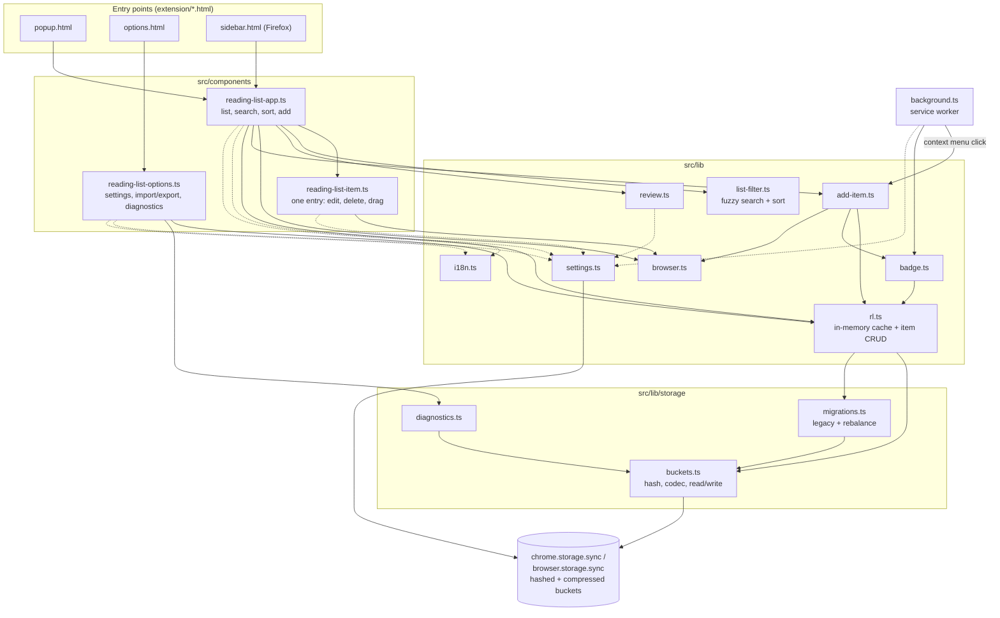
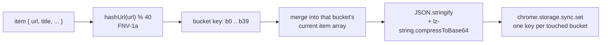

# AGENTS.md

Guidance for AI coding agents (Claude Code, or any other agent) working in this repository.

## Overview

This is a Chrome and Firefox browser extension for saving pages to read later. It uses Manifest V3, TypeScript, and Lit for web components. The extension is published on the Chrome Web Store and Firefox Add-ons.

## Architecture



Three HTML entry points, each mounting Lit components:

- **`extension/popup.html`** — the popup shown when clicking the extension icon, mounts `<reading-list-app>`
- **`extension/options.html`** — settings page, mounts `<reading-list-options>`
- **`extension/sidebar.html`** — Firefox sidebar panel, mounts the same `<reading-list-app>` bundle as the popup

Source (`src/`):

- **`src/background.ts`** — Manifest V3 service worker: context menu ("Add page to Reading List"), badge sync on tab activate/update, no persistent background context
- **`src/components/reading-list-app.ts`** — main list UI: search/filter/sort, add-current-page button, drag-and-drop reordering, staggered reveal animation
- **`src/components/reading-list-options.ts`** — settings page: default-behavior checkboxes, export/import, Storage Diagnostics, Clear Reading List
- **`src/components/reading-list-item.ts`** — a single list entry: inline title editing, slidein/slideout animations, delete/edit buttons
- **`src/components/theme.styles.ts`** — the palette tokens whose values are identical across components (`--rl-bg-color`, `--rl-shadow`, `--primary-color`), light and dark. Composed per component as `static override styles = [theme, styles]`.
- Each component also has its own `*.styles.ts` (Lit `css` template) for everything else — **Shadow DOM means CSS custom properties with the same name in different components are completely independent**. Some tokens deliberately differ and must stay local: `--rl-link-hover-bg` (app `#f7f7f7` vs item `#fff`) and, in dark mode, `--rl-link-color` (app `#000` vs item `#eee`). The options component shares nothing — it uses only `--rl-bg-color`/`--rl-text-color`, with values unrelated to the shared palette.
- **`src/lib/rl.ts`** — the `RL` in-memory cache and item CRUD (see Storage architecture below)
- **`src/lib/storage/buckets.ts`** — bucket codec: hashing, keys, compress/decompress, read/write, and `ListItemData`
- **`src/lib/storage/migrations.ts`** — legacy one-key-per-item migration and the bucket-count rebalance
- **`src/lib/storage/diagnostics.ts`** — `getStorageDiagnostics()`, behind the Options → Advanced button
- **`src/lib/settings.ts`** — `Settings`, `DEFAULT_SETTINGS`, `getSettings()`, `updateSettings()`
- **`src/lib/add-item.ts`** — build an item, add it, log failure, sync the badge; shared by the popup and the context menu
- **`src/lib/list-filter.ts`** — fuzzy search (Fuse.js) + sort/filter logic
- **`src/lib/badge.ts`** — sets the toolbar badge (✔) when the active tab's URL is already on the list
- **`src/lib/browser.ts`** — Firefox/Chrome detection, `getActiveTab()`, tab-opening helper
- **`src/lib/review.ts`** — synthetic "leave a review" nag list item (shown once, after 6+ saved items)
- **`src/lib/i18n.ts`** — thin wrapper over `chrome.i18n.getMessage`, backed by `_locales/`

`extension/shell.css` holds the page-shell CSS (`:root` tokens, reset, `body` typography, dark mode) shared by `popup.html` and `sidebar.html`, which are otherwise identical apart from the popup's fixed width and the `body` class.

**Relative imports carry `.js` extensions** (`import { x } from './storage/buckets.js'`), with `moduleResolution: "bundler"` in `tsconfig.json`. This is required once these modules import each other and are loaded as native ESM — dropping the extension breaks resolution outside the bundler (e.g. the Node test harness below). Keep it consistent; a single extensionless import is enough to break things in a confusing way.

## Storage architecture (`src/lib/rl.ts`, `src/lib/storage/`)

Items are **not** stored one key per bookmark. `chrome.storage.sync`/`browser.storage.sync` cap the item count at `MAX_ITEMS = 512` **keys**, regardless of value size — storing `{ [item.url]: item }` per bookmark (the original design) hard-caps the list at ~511 items even when the ~100KB byte quota has headroom left.

Instead, items are grouped into a fixed number of **hashed buckets** (`BUCKET_COUNT = 40`, key format `b${hash(url) % 40}`), each holding a compressed array of items. This removes the per-item key cap; the real ceiling becomes the ~100KB total byte quota. Verified capacity: **~1,200 items** (vs. ~511 with the old per-item-key scheme).



Two non-obvious things to know before touching this code:

1. **Compression must be `compressToBase64`, not `compressToUTF16`.** `lz-string`'s `compressToUTF16` packs data into high-value UTF-16 code points to maximize density *per code unit* — but `chrome.storage.sync`/`browser.storage.sync` measure quota usage in real **UTF-8 bytes** (however they serialize for sync/persistence), and those code points mostly cost 3 bytes each in UTF-8. In practice this made `compressToUTF16` output use **~2.8x more real storage** than its JS string `.length` suggested — bad enough that it was no better than storing uncompressed JSON. `compressToBase64` is ASCII-only (1 byte per character), so it doesn't have this blowup, and nets a genuine ~35-40% size reduction. `decodeBucket()` tries base64 first and falls back to the UTF16 decoder, so buckets written before this fix still read correctly.
2. **`BUCKET_COUNT` must stay small enough that each bucket holds many items.** LZ-style compression only pays off when there's redundant text within one blob (repeated property names, similar URLs). At 512 buckets, most buckets held only 1-4 items each — too little redundancy to compress well, plus fixed per-blob format overhead on every bucket. 40 buckets was chosen empirically as the point where each bucket's blob is big enough for compression to help while staying safely under the 8KB-per-bucket quota (see the byte-math comment above `BUCKET_COUNT` in `rl.ts` for the numbers). If `BUCKET_COUNT` needs to change again, bump the version and rely on the rebalance migration below — don't just edit the constant.

**Migrations run automatically inside `getListItems()`** (via `loadAllBucketStorage()`), in order:
1. `migrateLegacyItems()` — one-time move from the original one-key-per-URL layout into buckets, for anyone updating from before bucketing existed. Verifies the new bucket keys were written correctly before removing the old ones.
2. `rebalanceBucketsIfNeeded()` — versioned via a `__bv` storage key holding the `BUCKET_COUNT` last used. If it doesn't match the current `BUCKET_COUNT`, all existing items are re-read (works regardless of the old scheme, since it just scans any `b\d+` key), re-grouped under the current scheme, and old bucket keys no longer used by the new scheme are deleted. This is what makes changing `BUCKET_COUNT` safe.

**Never loop a per-item write.** `chrome.storage.sync` has a write-rate limit, and each `addReadingItem`/`updateReadingItem` is its own `set()` call. At the ~1,200-item capacity this design allows, any `for (item of items) await rl.updateReadingItem(...)` will blow that limit. This has bitten twice: once in `importList()` (failed at item ~450 of 3,000) and once in drag-reorder (~1,200 writes per drag). Both now group items by bucket and write each bucket once — `rl.bulkAddReadingItems(items)` (chunked, with retry/backoff) and `rl.reorderItems(urls)` (a single `set()`). Reuse `groupItemsByBucket()` rather than adding a third copy of that logic.

Observed write-rate failures came after as few as ~20 sequential calls, noticeably stricter than the commonly-cited 120/min figure — worth re-verifying against current MDN/Chrome docs rather than trusting that number.

**`updateReadingItem` skips no-op writes.** It returns early when every key in `updates` already equals the current value, because `background.ts` calls it with `{viewed: true}` on every tab activation and would otherwise re-write the bucket on every switch to an already-viewed saved page.

**The mutators lazily initialize.** `addReadingItem`/`removeReadingItem`/`updateReadingItem` call `getListItems()` themselves if needed. They used to silently `return` when uninitialized, which made `viewed` tracking depend on `handleTabUrl` happening to call `syncBadgeForTab()` (and thus `getListItems()`) first — reordering two lines would have broken it with no error.

**Any code path that writes to storage outside `rl`'s own methods must also update `rl`'s in-memory cache**, or go through `rl`. `rl` is a per-page singleton (`export const rl = new RL()`) holding `this.list` + `this.initialized`; `getListItems()` only re-fetches from storage when `!this.initialized`. `_onResetClick()` used to call `chrome.storage.sync.clear()` directly, which left the in-memory cache stale — Export right after Clear would return the old cached list even though storage was actually empty. Use `rl.clearAll()` instead, which clears storage and resets the cache together.

**`getStorageDiagnostics()`** (wired to the "Storage Diagnostics" button in Options → Advanced) reports item/bucket counts and both `chrome.storage.sync.getBytesInUse()` (the browser's real number) and a manual UTF-8-byte estimate side by side. If those two numbers ever diverge significantly again, that's the fastest way to catch another byte-accounting bug like the one above — trust `getBytesInUse()` over any hand-rolled estimate.

## Build and Development

### Commands

```bash
npm install           # Install dependencies
npm run build          # tsc && rollup -c — compiles TS to extension/scripts/, bundles to build/
npm run format          # Format code with Prettier
npx tsc --noEmit         # Fast typecheck only, skips the Rollup bundle step — use this while iterating
```

There is no automated test suite (`npm test` is a stub). For logic that touches `chrome.storage.sync` (`rl.ts` and `lib/storage/`), the established pattern is: compile with `npm run build`, then run a small Node script that sets `globalThis.chrome.storage.sync` to an in-memory mock (get/set/remove/clear/getBytesInUse) and dynamically `import()`s the compiled output under `extension/scripts/lib/` directly — no browser needed.

Two things make these mocks worth writing carefully:
- **Enforce the real quotas.** A mock that also enforces `QUOTA_BYTES`, `QUOTA_BYTES_PER_ITEM` and the write-rate limit (throwing the same `QuotaExceededError` shape) is what caught both the bucket-count and compression-encoding bugs. A permissive mock passes and hides real quota problems.
- **Count `set()` calls.** Asserting on the number of write operations is how the per-item-write bugs above get caught before they ship.

### Full package + verify workflow

After a change to anything under `src/` or `extension/`, this is the loop used throughout this project:

```bash
npm run build
rm -f dist/reading-list-chrome.zip
(cd build && zip -r -q -X ../dist/reading-list-chrome.zip . -x '*.DS_Store')
npx web-ext build --source-dir=build --artifacts-dir=dist --overwrite-dest --filename=reading-list-firefox.zip
npx web-ext lint --source-dir=build
```

### Loading into Browser

**Chrome:**
1. Go to `chrome://extensions/`
2. Enable "Developer Mode"
3. Click "Load unpacked" (first time) → select the `build` folder, or click the reload icon (↻) on the extension's card thereafter
4. Chrome does **not** auto-reload an unpacked extension when files on disk change — always click reload after rebuilding

**Firefox:** `about:debugging#/runtime/this-firefox` → "Load Temporary Add-on" (accepts either the `build` folder's `manifest.json` or `dist/reading-list-firefox.zip`) → click "Reload" on the same entry after rebuilding; it re-reads from whichever path/file you originally loaded.

## Key Implementation Details

- **Manifest V3**: service worker, no persistent background context. The manifest's `content_security_policy.extension_pages` only honors a narrow set of directives (`script-src`, `object-src`) — `script-src-attr` is silently discarded, so inline event-handler attributes (e.g. `onerror="..."`) get blocked by Chrome's platform-default CSP instead. Use Lit `@event` bindings, never inline handlers.
- **Storage**: see Storage Architecture above.
- **Context Menu**: `chrome.contextMenus` API, toggled by the `addContextMenu` setting.
- **Firefox `page_action`**: deliberately **not implemented**. Chrome removed `page_action` entirely in MV3; Firefox still supports it but has stated intent (since ~2022, still not done as of this writing) to eventually merge it into `action`. Decided not worth building on a soon-to-be-deprecated API — re-verify current status before reconsidering.
- **Web Components**: Lit, TypeScript decorators, reactive properties.
- **i18n**: `_locales/` + `src/lib/i18n.ts`.
- **Settings**: defaults live in one place, `DEFAULT_SETTINGS` in `src/lib/settings.ts`. `getSettings()` merges them and returns `Required<Settings>`, so callers read `settings.animateItems` directly — don't reintroduce `?? true` fallbacks at call sites.
- **Dark mode**: `@media (prefers-color-scheme: dark)` blocks per component, matched to the original (pre-rewrite) app's actual Stylus color values where parity was the goal. When adding a dark-mode override for a selector that also has a base (light-mode) rule, put the dark block **after** the base rule in source order — a dark-mode override placed before an equal-specificity base rule is silently always beaten by it, regardless of whether the media query matches (this bit the options-page button colors once already). The same ordering applies across the `static styles = [theme, styles]` array: later entries win ties, so a component's own declarations override `theme.styles.ts`.

## Current Feature Status

See `README.md` for the feature checklist.

## TypeScript Configuration

- Target: ES2021
- Strict mode enabled
- Output: `extension/scripts/`
- Uses `ts-lit-plugin` for Lit template type checking
