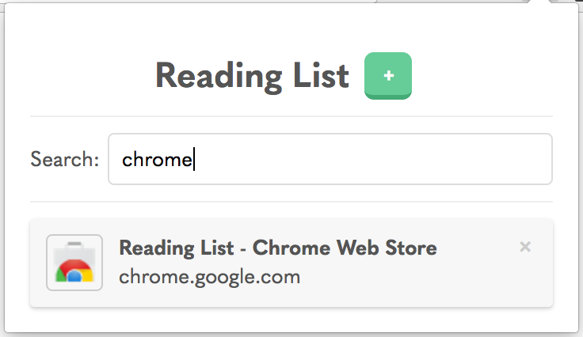

# Reading List

A Chrome and Firefox extension for saving pages to read later. Free on the [Chrome Web Store](https://chrome.google.com/webstore/detail/lloccabjgblebdmncjndmiibianflabo) and [Firefox Addons](https://addons.mozilla.org/firefox/addon/reading_list/).



## Features

  - Nifty animations
  - Search
  - Syncing with Google/Mozilla accounts
  - A light and dark theme

## Installation

Get it from the [Chrome Web Store](https://chrome.google.com/webstore/detail/lloccabjgblebdmncjndmiibianflabo) or [Firefox Addons](https://addons.mozilla.org/firefox/addon/reading_list/) for free.

### Building

Or, if you would rather do it the hard way, you can build the extension from the source code:

  1. Make sure you have Node and NPM installed
  1. Download/clone this repo
  1. Install all the dependencies:
      ```bash
      # From the project folder
      npm install
      ```
  1. Run the build command:
      ```bash
      npm run build [chrome/firefox]
      ```

The build command assembles all the files in the `dist` folder. After it’s built, you can load it into Chrome or Firefox.

#### Load into Chrome

  1. Go to [chrome://extensions/](chrome://extensions/)
  1. Check “Developer Mode”
  1. Click “Load unpacked extension…”
  1. Load up the “dist” folder

#### Load into Firefox

  1. Go to [about:addons](about:addons)
  1. Select “Extensions”
  1. Click the settings cog, and select “Install Add-on From File…”
  1. Load up the “dist” folder

## Using the extension

  1. Go to a page you want to save for later
  1. Click the reading list icon on the top right of your browser 
  1. Click the `+` button
      - You can also right-click anywhere on the page and select “Add page to Reading List”
  1. When you want to read a page you saved, open up the extension and click the reading item you want to read
      - `Control + click` or `command ⌘/windows key ⊞ + click` to open the page in a new tab
  1. Done with a page? Click the `×` next to said page in your reading list, and it will magically vanish.
