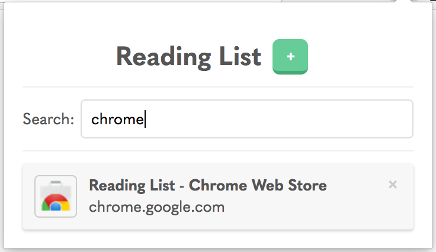

# Reading List

A Chrome and Firefox extension for saving pages to read later. Free on the [Chrome Web Store](https://chrome.google.com/webstore/detail/lloccabjgblebdmncjndmiibianflabo) and [Firefox Addons](https://addons.mozilla.org/firefox/addon/reading_list/).



## Features

This is a from-scratch rewrite of the original extension — Manifest V3, TypeScript, and Lit web components instead of the original's Manifest V2 and vanilla JS.

**Carried over from the original:**

- Nifty animations
- Search
- Syncing with Google/Mozilla accounts
- A light and dark theme
- Context menu
- Open in new tab option
- Import/export
- Extension icon badge for pages already on your list
- Sort by date/title, filter by read/unread
- Inline title editing
- Drag-and-drop manual reordering
- Firefox sidebar panel

**New in this version:**

- Compressed, bucketed storage — holds several hundred+ items instead of the original's hard ~511-item limit, with no per-item key cap
- Storage Diagnostics (Options → Advanced) to check real usage against the browser's sync quota

**Not carried over:** the original's Firefox-only address-bar toggle icon (`page_action`). Chrome removed that API entirely in Manifest V3, and Firefox has long signaled intent to fold it into the unified `action` API without having done so — not worth building against something already headed for deprecation.

## Installation

Get it from the [Chrome Web Store](https://chrome.google.com/webstore/detail/lloccabjgblebdmncjndmiibianflabo) or [Firefox Addons](https://addons.mozilla.org/firefox/addon/reading_list/) for free.

### Building

Or, if you would rather do it the hard way, you can build the extension from the source code:

1. Make sure you have Node and NPM installed
1. Download/clone this repo
1. Install all the dependencies:
   ```bash
   # From the project folder
   npm install
   ```
1. Run the build command:
   ```bash
   npm run build
   ```

The build command assembles all the files in the `build` folder. After it’s built, you can load it into Chrome or Firefox.

#### Load into Chrome

1. Go to [chrome://extensions/](chrome://extensions/)
1. Check “Developer Mode”
1. Click “Load unpacked extension…”
1. Load up the “build” folder

Chrome doesn’t auto-reload an unpacked extension when the code changes — after rebuilding, click the reload icon (↻) on the extension’s card to pick up the new code.

#### Load into Firefox

1. Go to `about:debugging#/runtime/this-firefox`
1. Click “Load Temporary Add-on…”
1. Select `build/manifest.json` (or a packaged `.zip` built with `web-ext build`)

Firefox removes temporary add-ons when you close the browser, and doesn’t auto-reload on code changes either — after rebuilding, click “Reload” on the same entry in `about:debugging`.

## Using the extension

1. Go to a page you want to save for later
1. Click the reading list icon on the top right of your browser 
1. Click the `+` button
   - You can also right-click anywhere on the page and select “Add page to Reading List”
1. When you want to read a page you saved, open up the extension and click the reading item you want to read
   - `Control + click` or `command ⌘/windows key ⊞ + click` to open the page in a new tab
1. Done with a page? Click the `×` next to said page in your reading list, and it will magically vanish.
